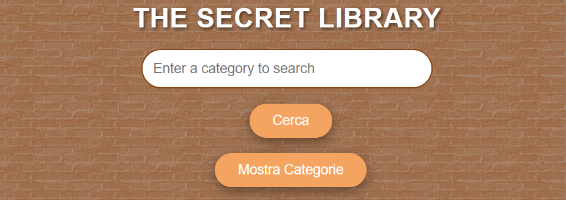
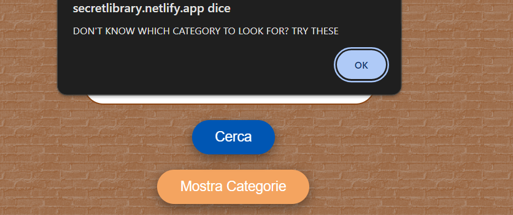
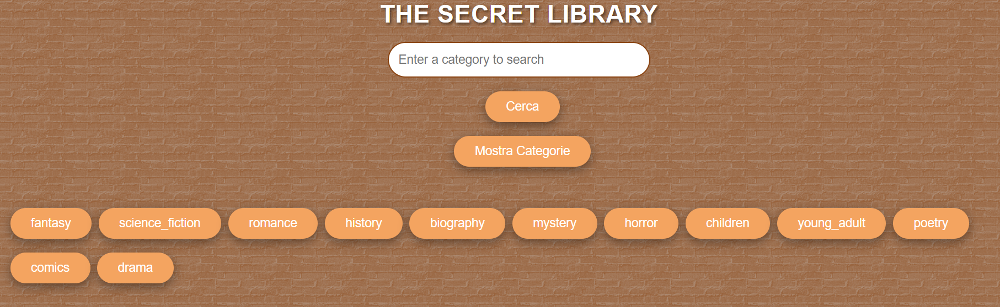
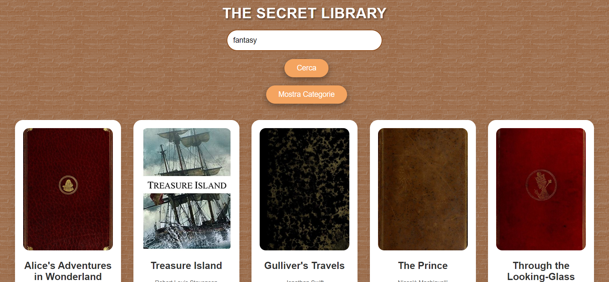

<h1 align="center">Hi 👋, I'm Fabio</h1>
<h3 align="center">A passionate frontend developer from Italy</h3>

- 🔭 I’m currently working on [The Secret Library](https://secretlibrary.netlify.app/)

- 👨‍💻 All of my projects are available at [https://ftjourney.netlify.app](https://ftjourney.netlify.app)

<h3 align="left">Some screenshots of my app:</h3>

From here you can search by book category

If you try to search without entering any categories, an error message will be shown and once closed, buttons with categories will appear to give you some ideas for searching.

Once the category has been entered, books will be displayed. Clicking on it will display the description

<h3 align="left">Languages and Tools:</h3>

    

